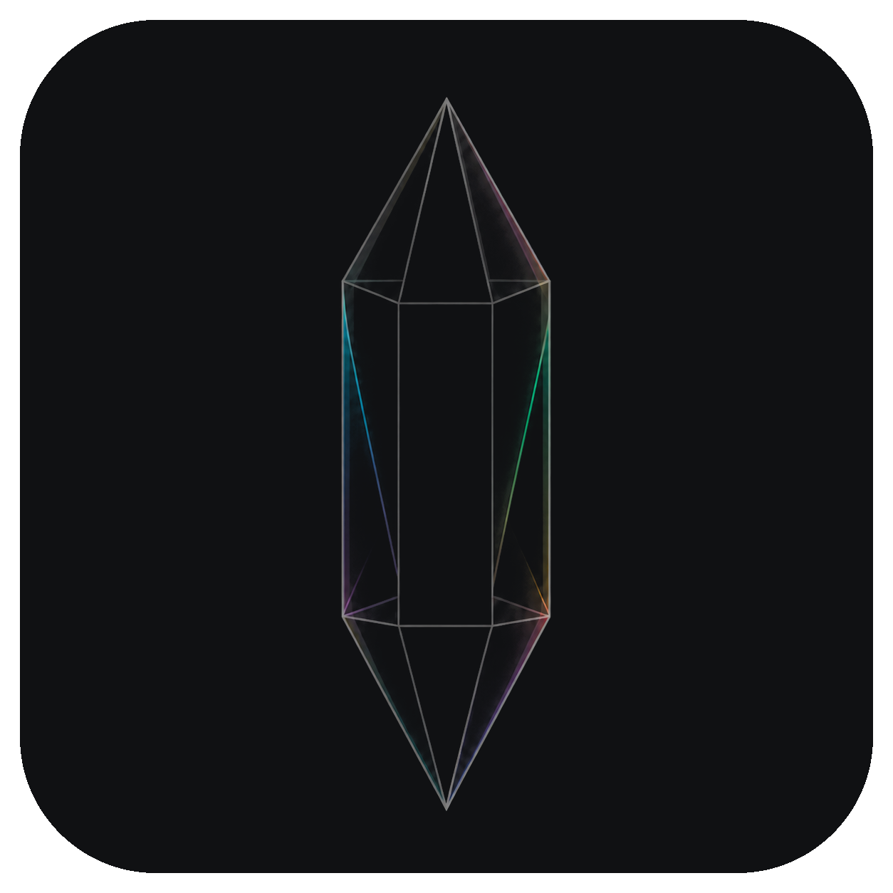

<p align="center">
  
</p>

<h1 align="center">Prism</h1>

<p align="center">
  <strong>Calm, typed Roblox UI primitives — refracted through React.</strong>
</p>

<p align="center">
  <a href="#-components">Components →</a>
  ·
  <a href="#-quick-start">Quick start →</a>
  ·
  <a href="#-playground">Playground →</a>
  ·
  <a href="DESIGN.md">Design system →</a>
</p>

<div align="center">


</div>

**Prism** is a Roblox TypeScript UI kit for [`@rbxts/react`](https://github.com/roblox-ts/react).
It pairs familiar, composable components with theme tokens, Roblox-native sizing, and deliberate
escape hatches for the places where an experience needs more control.

- 🧩 **Build with typed primitives** for layout, forms, navigation, feedback, and overlays
- 🎨 **Keep UI coherent** with semantic color, spacing, radius, type, shadow, and motion tokens
- 📐 **Size things the Roblox way** with offsets, percentages, `UDim`, and `UDim2`
- 🔧 **Reach the underlying instances** through last-write-wins `slotProps`

> [!NOTE]
> Prism is early and private (`0.0.0`). It is not published to npm yet.

## 🧩 Components

| Family               | Components                                                                                     |
| -------------------- | ---------------------------------------------------------------------------------------------- |
| **Layout**           | `Box`, `Stack`, `Divider`, `Card`, `ScrollArea`                                                |
| **Text and media**   | `Text`, `Icon`, `Image`, `Avatar`                                                              |
| **Inputs and forms** | `Button`, `Pressable`, `Input`, `KeybindInput`, `Checkbox`, `Switch`, `StepperInput`, `Slider` |
| **Feedback**         | `Progress`, `CircularProgress`, `Backdrop`                                                     |
| **Navigation**       | `SegmentedControl`, `Tabs`, `Menu`, `Select`                                                   |
| **Overlays**         | `WorldPortal`, `Popover`, `Modal`, `Tooltip`                                                   |
| **Utility**          | `Draggable`                                                                                    |

Prism also includes `@prism/theme` for providers and tokens, `@prism/motion` for motion hooks,
`@prism/utils` for unit helpers, and `bridge` for Luau interop through `mountPrism`.

---

## 📦 Quick start

Prism needs [Node.js](https://nodejs.org/), [Rojo](https://rojo.space/), and Roblox Studio.

```sh
npm install
npm run build
rojo serve
```

Wrap your UI in `ThemeProvider`, then compose primitives:

```tsx
import React from "@rbxts/react";
import { Button, Divider, Stack, Text } from "@prism";
import { ThemeProvider, theme } from "@prism/theme";

export function ServerControls() {
	return (
		<ThemeProvider>
			<Stack width={280} bg={theme.primary.main} radius="md" p="md" gap="sm">
				<Text size="lg" color={theme.text.inverse} text="Server controls" />
				<Divider color={theme.border.subtle} />
				<Button variant="light" color="secondary" label="Save changes" />
			</Stack>
		</ThemeProvider>
	);
}
```

Text is passed through `text` and `label` props. JSX text children are not type-supported on
`forwardRef` components in this toolchain.

## 🎨 Tokens and units

Intent props take semantic strings such as `color="success"`. Concrete color props take `theme.*`
references or raw `Color3` values; dotted strings such as `"text.secondary"` are not accepted.

```tsx
<Button color="success" variant="filled" label="Publish" />
<Text color={theme.text.secondary} text="Autosaved just now" />
<Stack bg={Color3.fromRGB(20, 20, 20)} radius="lg" p="md" />
```

Sizing stays Roblox-native: numbers are pixel offsets, percentage strings are scale, and `UDim` or
`UDim2` values pass through unchanged.

```tsx
<Stack width={280} />
<Stack width="50%" />
<Stack width={new UDim(0, 280)} />
```

Size tokens from `"xs"` through `"xl"` cover spacing, radius, and text size. Invalid tokens throw in
development.

## 🔧 Escape hatches

Use `slotProps` for instance properties that the component API does not cover. They are applied
last.

```tsx
<Button
	label="Danger"
	color="error"
	variant="outline"
	slotProps={{
		root: { LayoutOrder: 10 },
		stroke: { Thickness: 2 },
	}}
/>
```

Components own their internal motion. Avoid overriding a property through `slotProps` when the same
property is being animated.

## ✨ Motion

`useMotion` animates numbers, `Color3` values, and theme references with the same tokens Prism uses
internally:

```tsx
const animated = useMotion({
	values: {
		scale: hovered ? 1.04 : 1,
		bg: hovered ? theme.primary.light : theme.background.surface,
	},
	transition: { duration: "fast", easing: "out" },
});
```

## 🧪 Playground

[ui-labs](https://ui-labs.luau.page/) stories live in `src/playground/stories`.
`index.storybook.ts` configures the storybook, while `index.ts` imports each `*.story` module so
roblox-ts emits it. Add new component examples as `*.story.tsx` files in that directory.

## 🛠️ Development

```sh
npm run typecheck
npm run lint
npm test
npm run build
```

Prism deliberately does not target npm publishing, Wally, polymorphic `as` props, app-shell
patterns, or timeline/keyframe animation yet.
